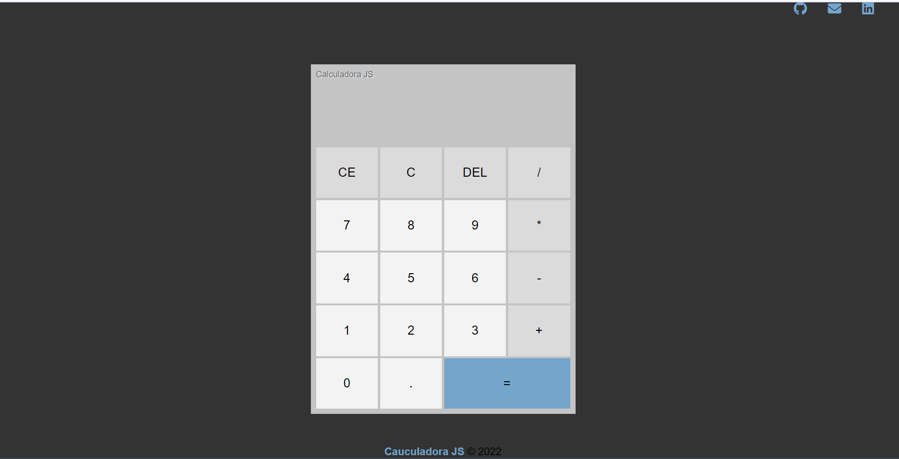

><h1>Calculadora JS</h1>

<h2 align="center">
  Acesse a Calculadora JS clicando <a target="_blank" href="https://erick-sarges.github.io/Calculadora/">AQUI</a>!
</h2>

 

  <a href="#clipboard-sobre-o-projeto">Sobre o Projeto</a>&nbsp;&nbsp;&nbsp;|&nbsp;&nbsp;&nbsp;
  <a href="#computer-tecnologias-utilizadas">Tecnologias</a>

## :clipboard: Sobre o Projeto

- Uma calculadora que realiza operações básicas de matemática. 
- Seu estilo foi feito baseado na calculadora do sistema operacional <b>Windows 10<b>.

## :computer: Tecnologias utilizadas
O projeto foi desenvolvido utilizando as seguintes tecnologias:
- <b>HTML</b>
- <b>Scss</b>
- <b>JavaScript</b>